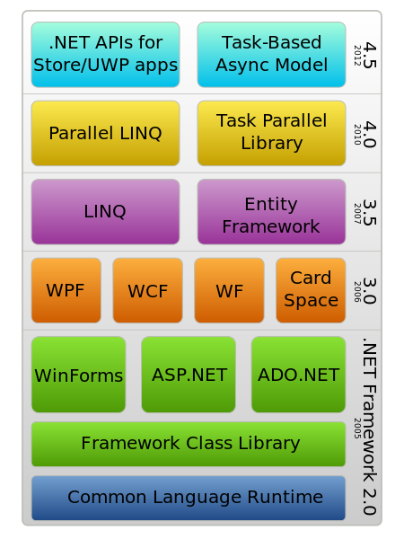
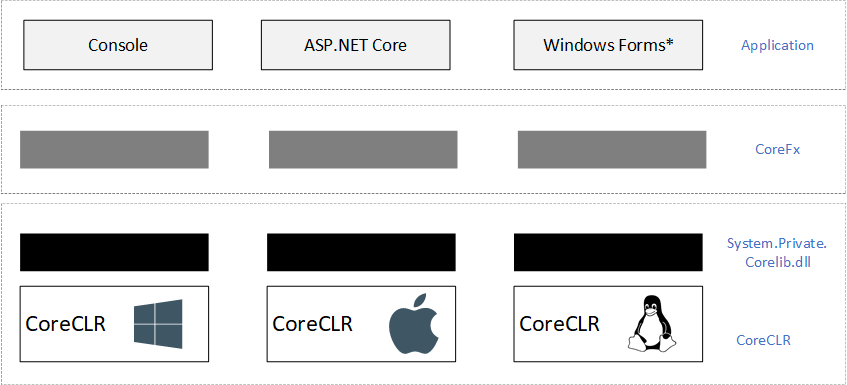

## 1 .Net Framework 
我们都知道 `.Net Framework` 是运行在 `Windows` 桌面和服务器端的基础框架，架构如下



按照使用场景可划分为三个主要的部分

- CLR (Common Languge Runtime)：截止到目前为止，CLR 主要由 4 个版本，分别为 CLR 1.0，1.1， 2.0， 4.0 。
- BCL (Basic Class Library): 描述基础数据类型和数据结构，同时也提供一些基础性操作（IO，诊断，反射，文本编码等等）。
- AppModel: 应用模型，比如ASP.NET, WCF, WPF 等等。

BCL 大部分定义在 `mscorlib.dll` 这个应用程序集合中，随着 `.Net Framework` 的发展，这个基础应用程序集越来越大，这个对于一些嵌入式设备或者移动设备一点不够友好。针对这种问题，除了对于桌面和服务器设备上的完整的 `.Net Framework`，微软还推出了一系列压缩版的 `.Net Framework`。这样就带来了不同平台之间的 `.Net Framework` 是相互独立的，很难编写出跨平台的代码。

刚刚只是探索了在不同 `Windows` 之间的跨平台技术，对于非 `Windows` 的跨平台在 `.Net Core` 没有出现之前，是由 `Mono` 和 `Xamarin` 来实现这个目标。

微软在 `.Net` 平台推出的时候，就引入了 CLI (Common Language Infrastruture) 的概念，它定义了一种介于高级语言和机器语言的之间的中间语言 (Common Intermediate Language, CIL)，任何语言只要能够转成为 CIL，就能够被执行。这样对于 `.NET` 语言跨平台提供了可能。


虽然通过 `Mono` 和 `Xamarin` 实现了跨平台，但是它们用的是单独的类库和运行时，因此跨平台应用仍然是一个巨大的挑战。

## 2 代码复用

一个编程语言的的流行不仅仅是强大的基础库，优秀的性能还需要繁荣的社区。每个软件开发者都希望自己的软件或者库可以运行在不同的环境中或者被很多人使用。因此程序集的复用是 `.Net` 生态中重要的内容。
在 `.Net` 语言在编译后生成的程序集不单单包含了程序的代码，还包含了程序集和元数据（Manifest），可以通过 `ildasm.exe` 这个工具查看。


假设我们有这么一个实例程序

```C#
class Program 
{
    static void Main()
    {
        Console.WriteLine(typeof(int).Assembly.FullName);
        Console.WriteLine(typeof(XmlDocument).Assembly.FullName);
        Console.WriteLine(typeof(DataSet).Assembly.FullName);
    }
} 
```

选择 `CLR 2.0` 的运行时，输出的结果如下

```
mscorlib, Version=2.0.0.0, Culture=neutral, PublicKeyToken=b77a5c561934e089
System.Xml, Version=2.0.0.0, Culture=neutral, PublicKeyToken=b77a5c561934e089
System.Data, Version=2.0.0.0, Culture=neutral, PublicKeyToken=b77a5c561934e089
```

但是将换成 `CLR 4.0` 的时候 (修改 `<app>.exe.config` 文件)

```diff
<?xml version="1.0" encoding="utf-8"?>
<configuration>
  <startup>
-    <supportedRuntime version="v2.0.50727" />
+    <supportedRuntime version="v4.0" />
  </startup>
</configuration>
```

结果却是这样的
```
mscorlib, Version=4.0.0.0, Culture=neutral, PublicKeyToken=b77a5c561934e089
System.Xml, Version=4.0.0.0, Culture=neutral, PublicKeyToken=b77a5c561934e089
System.Data, Version=4.0.0.0, Culture=neutral, PublicKeyToken=b77a5c561934e089
```

因此，我们得到的第一个结论

> 1. 运行过程中加载的程序集是有当前的运行时对应的版本

如果在一个应用程序中使用了强类型程序集，那么 CLR 在执行的过程中会查找文件名，版本和公钥一致的应用程序集。这些都被定义在 `Manifest` 中

```
.assembly extern Foo
{
  .ver 1:0:0:0
}
```

但是如果为了是我们的程序集的能够在使用的避免因文件版本或者签名不同导致的 `FileNotFoundException`, 可以在应用程序集添加

```C#
[assembly:AssemblyFlags(AssemblyNameFlags.Retargetable)]
```

那么在应用程序中得到的 `Manifest` 则如下

```
.assembly extern retargetable Foo
{
  .ver 1:0:0:0
}
```

这样在程序运行的过程中，在程序集查询的时候，就会进行降级处理，只匹配文件名，所以第二个结论就是

> 2 程序集中的 retargetabe 可以帮助我们避免程序集缺失导致的问题。

现在我们有下面一段代码，选择 `.Net Framework 3.5`

```C#
class Program
{
    static void Main(string[] args)
    {
        Console.WriteLine(typeof(string).Assembly.FullName);
        Console.WriteLine(typeof(Func<>).Assembly.FullName);
    }
}
```
执行的结果如下

```
mscorlib, Version=2.0.0.0, Culture=neutral, PublicKeyToken=b77a5c561934e089
System.Core, Version=3.5.0.0, Culture=neutral, PublicKeyToken=b77a5c561934e089
```

我们知道，`string` 类型来自 `mscorlib` 程序集, 而 `Func<>` 来自 `System.Core` 程序集。
但是如果我们修改 `App.exe.config` 文件，使它在 `CLR 4.0` 下运行

```
mscorlib, Version=4.0.0.0, Culture=neutral, PublicKeyToken=b77a5c561934e089
mscorlib, Version=4.0.0.0, Culture=neutral, PublicKeyToken=b77a5c561934e089
```

这时，`string` 类型仍然在 `mscorlib` 程序集，而 `Func<>` 则被转移到 `mscorlib` 程序集中。那么这个使怎么做到的呢？答案就是类型转移，由于我们的程序集的 `Manifest` 没有发生改变，因为在 `manifest` 仍然要寻找 `System.Core.dll` 程序集，但是在 `4.0` 版本中，将它转移到 `mscorlib` 中

```
// System.Core.dll (v4.0)
.class extern forwarder System.Func`1
{
  .assembly extern mscorlib
}
```

> 3 通过 `forarder` 技术，可以将当前的程序中的类型转移到其他的程序集

## 3 .NET Core

众所周知，`.NET Core` 是开源的跨平台的实现，它主要解决了两个问题
- 为 CIL 提供一致性的执行环境
- 提供统一的 BCL，解决代码复用的问题




接下来我们看看 `.Net Core` 中类型转移是怎么样的

```C#
static void Main(string[] args)
{
    Console.WriteLine(typeof(string).Assembly.FullName);
    Console.WriteLine(typeof(int).Assembly.FullName);
    Console.WriteLine(typeof(bool).Assembly.FullName) ;
}
```

在 `.net core` 运行结果如下

```
System.Private.CoreLib, Version=5.0.0.0, Culture=neutral, PublicKeyToken=7cec85d7bea7798e
System.Private.CoreLib, Version=5.0.0.0, Culture=neutral, PublicKeyToken=7cec85d7bea7798e
System.Private.CoreLib, Version=5.0.0.0, Culture=neutral, PublicKeyToken=7cec85d7bea7798e
```

但是查看执行程序的 `Manifest`, 我们可以看到它只引用了 `System.Runtime` 和 `System.Console` 两个应用程序集。通过前面我们知道，这一定是用了类型转移，在 `System.Runtime` 程序中，将 `String`, `int` 和 `bool` 类型转移到 `System.Private.CoreLib` 这个程序集中。

在查看 `%ProgramFiles%\dotnet\shared\Micrsoft.NETCore.App\<version>` 文件夹中的 `System.Runtime.dll`的 manifest，我们可以看到

```
.class extern forwarder System.String
{
  .assembly extern System.Private.CoreLib
}
```

通过这种类型转移技术，我们可以在 `.Net Core` 中是用 `.Net Framework` 的类库。简单来讲，虽然在 `.NET Core` 重新设计和组织了各个类的实现和分布，但是可以通过同名的程序集，将需要的类转移到真正所在的程序集。

为了是应用程序既可以在 `.Net Framework` 或者 `.Net Core` 中使用，微软推出了 `.NET Standard` 这个概念。如果我们的应用程序是基于 `.NET Standard` 开发的，那么它既可以在 `.Net Framework` 上运行，也可以在 `.Net Core` 上运行。那么是怎么做到这一点的呢？很简单，`.NET Standard` 定义了很多 API，这些 `API` 在不同的运行环境中，比如 `.NET Framework` 或者 `.NET Core` 中都有相应的实现，比如通过类型的转移的方式跳转到真正实现的 API。 通过 `.NET Standard` 实现了代码程序集的复用。