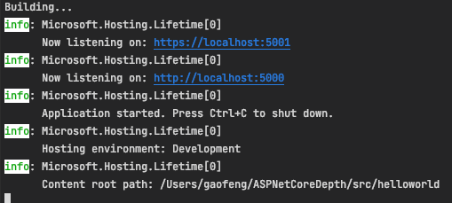
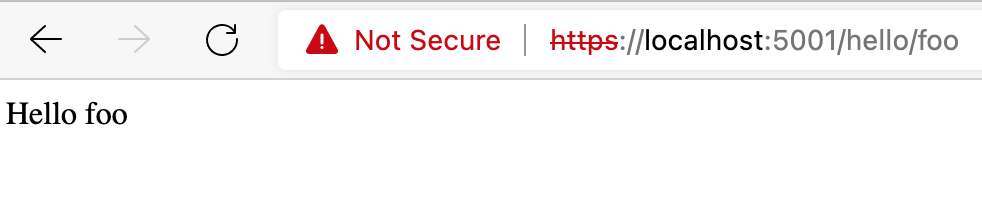

## 1 Hello World
接下来我们看一下最简单的 `ASP.NET Core` MVC 的项目: [Hello World](https://github.com/gaufung/ASPNetCoreDepth/tree/master/src/helloworld)

项目的结构如下 

```tree
+-- Controllers
|   +-- HelloController.cs
+-- Properties
|   +-- launchSettings.json
+-- Views
|   +-- Hello
|       +-- SayHello.cshtml
+-- appsettings.Development.json
+-- appsettings.json
+-- helloworld.csproj
+-- Program.cs
+-- Startup.cs
```

使用 `dotnet run` 命令就会得到如下的结果， 



打开浏览器，输入 `https://localhost:5001/hello/foo` 就会得到下面的结果




## 2 csproj 文件 

## 3 lauchSettings.json 文件

## 4 服务注册

## 5 视图文件

## 6 Startup 文件